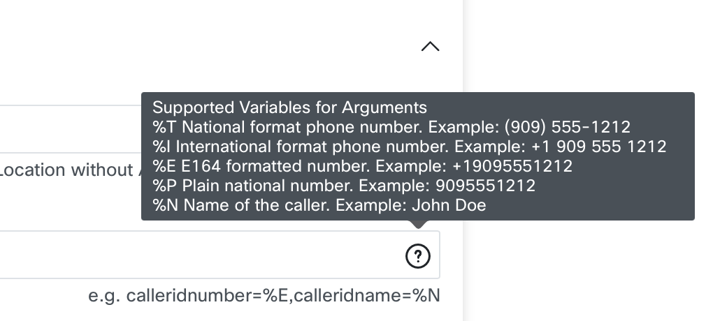
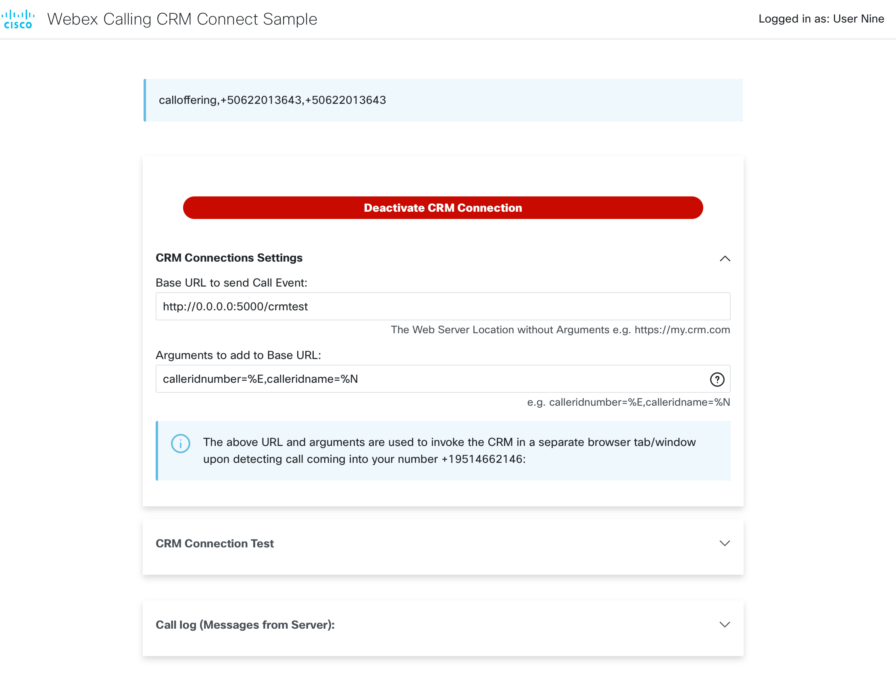

# GVE Devnet Webex Calling Webhook CRM Connect  

Sample handling of Webex Calling webhooks to integrate with cloud based CRM by passing to it new call arrival events. 


## Contacts

* Gerardo Chaves (gchaves@cisco.com)

## Solution Components
*  Webex Calling
*  Webex REST API


## Coding Guides used for oAuth implementation
 
Downgrading the requests-oauthlib library to version 0.0.0 to avoid the OAuth error:
https://github.com/requests/requests-oauthlib/issues/324

Example Oauth with Webex Teams:
https://github.com/CiscoDevNet/webex-teams-auth-sample

Walkthrough including how to refresh tokens:
https://developer.webex.com/blog/real-world-walkthrough-of-building-an-oauth-webex-integration

Refresh token example:
https://stackoverflow.com/questions/27771324/google-api-getting-credentials-from-refresh-token-with-oauth2client-client

## Installation/Configuration


- Install python 3.6 or later   

- Recommended: Setup a virtual environment (https://packaging.python.org/guides/installing-using-pip-and-virtual-environments/)  

- Register a Webex Teams OAuth integration per the steps described at https://developer.webex.com/docs/integrations  
  - For the initial testing, you can set the Redirect URL to: http://0.0.0.0:5000/callback or to whatever matches what you inted to use below for the **AUTH_BASE_ADDRESS** parameter  plus '/callback'  
  - Once you want to test the code that actually receives the call events and pops up the CRM, you will need to edit this field to put the external
  facing URL base posfixed by /callback. (i.e. https://78b3-179-50-245-41.ngrok.io/callback)  
    - IMPORTANT: Select the following scopes for the integration 'spark:all','spark:calls_read','spark:calls_write'  
    - Before closing the window, take note of the Client ID and Client Secret fields, you will need them below and you cannot retrieve the Client Secret later! (you can always re-generate it)  

- Once you clone the repository, edit the .env file to fill out the following configuration variables:  

**CLIENT_ID**     
Set this variable to the Client ID from your integration. See the [Webex Integrations](https://developer.webex.com/docs/integrations) documentation for more details.  
  
**CLIENT_SECRET**  
Set this variable to the Client Secret from your integration. See the [Webex Integrations](https://developer.webex.com/docs/integrations)  documentation for more details.  
   
**AUTH_BASE_ADDRESS**  
Set AUTH_BASE_ADDRESS to the URL where your instance of this Flask application will run. If you do not change the parameters 
of app.run() at the end of the main.py file, this should be the same value of 'http://0.0.0.0:5000' that is set by default 
in the sample code. (the code will then append /callback to it before making the API call to initiate the oAuth flow)   
NOTE: This URL does not actually have to map to a public IP address out on the internet, just an address that the 
the browser being used by the end user can reach. In production, the AUTH_BASE_ADDRESS and the WEBHOOK_ADDRESS are typically the same.  
  
**WEBHOOK_ADDRESS**
Set the WEBHOOK_ADDRESS to external facing URL where your instance of this Flask application will run. The code will then append /callevent to this
 address and use that to configure the Webhook that the Webex Calling cloud uses to notify this application of new call events.  
NOTE: This URL does have to map to a public IP address out on the internet for the Webex Calling cloud to be able to call it.   


## Usage

If you are running this sample on your local machine and not a location with an external URL, you can use the ngrok utility to 
obtain an externally addressable HTTPS URL. The following example assumes you kept the port specified in the sample code to run 
the flask web server from (5000):

`ngrok http 5000`

Obtain the external address ngrok is using and store it in `WEBHOOK_BASE_ADDRESS` environment variable in .env (i.e.  WEBHOOK_BASE_ADDRESS='https://df63-179-50-245-41.ngrok.io')   
You might want to also store it in the AUTH_BASE_ADDRESS environment variable for consistency. 

Now run the main application:  
 
    $ python app.py  

This will start a small Flask web application and, if you kept the default values, you should be able to access it by pointing a browser on your machine to
http://0.0.0.0:5000  or the external address provided to you by the ngrok utility.

You can now have Webex Calling users got to main login address. For example: 

```
http://0.0.0.0:5000/login?crmbase=http://0.0.0.0:5000/crmtest&crmargs="calleridnumber=%E,calleridname=%N"
```


In the example above we are passing in the string to use for the CRM's base URL (cmrbase) and arguments (crmargs). These are optional 
since they can be filled out by the end user in the User Connect page, but it is a convenient way for Webex organization administrators to 
communicate to users how to invoke this sample with the correct URL bas and arguments that will allow the sample to do screen pops with the organizations 
CRM. 
  
The user will first be prompted to log into their Webex account:  


Upon successful login, they will be presented with the main User Connect page where they can configure the CRM connection (if needed) and test the connection:  


  
  
If the cmrbase and/or crmargs arguments have not been passed into the login page, the user can fill them out. Instructions are shown by hovering 
above the info button:  

   

Before hitting the Activate button, users might want to test the CRM screen pop for accuracy and to make sure that their web browser is not blocking popups.   
To do so, they can expand the "testing" section and enter an E.164 formatted phone number and name which will automatically fill out the 
test URL field. NOTE: E.164 numbers must start with the + sign and country code (i.e. +12125551212)  
  
  

Once the parameters for testing are filled out you can click on the "Test CRM Connection" button and the CRM page configured should come up with the right parameters:  

   

Notice this screenshot corresponds to a "mock" CRM that is part of this sample application located at /crmtest  

Now the user is ready to "Activate" the integration so they can start receiving CRM screen pops. They can click on the large green "Activate CRM Connection" button which 
will turn red and with the label "Deactivate CRM Connection". From then on, whenever a call rings, it will be reflected in the user connect page:  

  

And a browser pop-up window will come up with the CRM of choice and, if the right arguments were passed, the correct customer record that corresponds 
with the caller ID.   

When they would like to stop receiving screen-pops, they can either close the window or hit the red "Deactivate CRM Connection" button.  


### LICENSE

Provided under Cisco Sample Code License, for details see [LICENSE](LICENSE.md)

### CODE_OF_CONDUCT

Our code of conduct is available [here](CODE_OF_CONDUCT.md)

### CONTRIBUTING

See our contributing guidelines [here](CONTRIBUTING.md)

#### DISCLAIMER:
<b>Please note:</b> This script is meant for demo purposes only. All tools/ scripts in this repo are released for use "AS IS" without any warranties of any kind, including, but not limited to their installation, use, or performance. Any use of these scripts and tools is at your own risk. There is no guarantee that they have been through thorough testing in a comparable environment and we are not responsible for any damage or data loss incurred with their use.
You are responsible for reviewing and testing any scripts you run thoroughly before use in any non-testing environment.